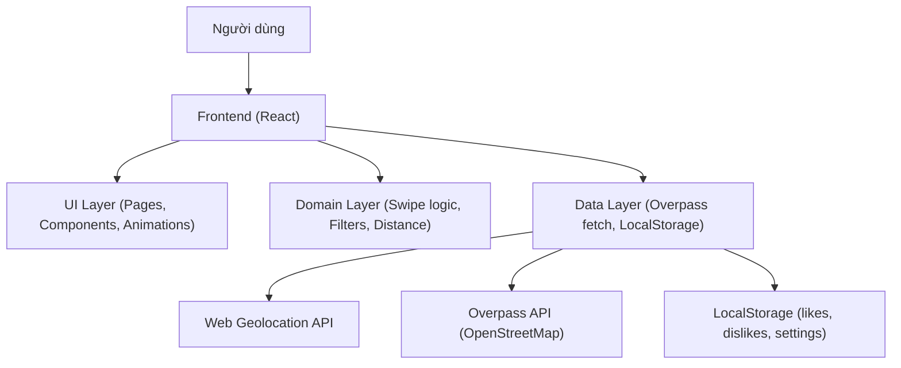
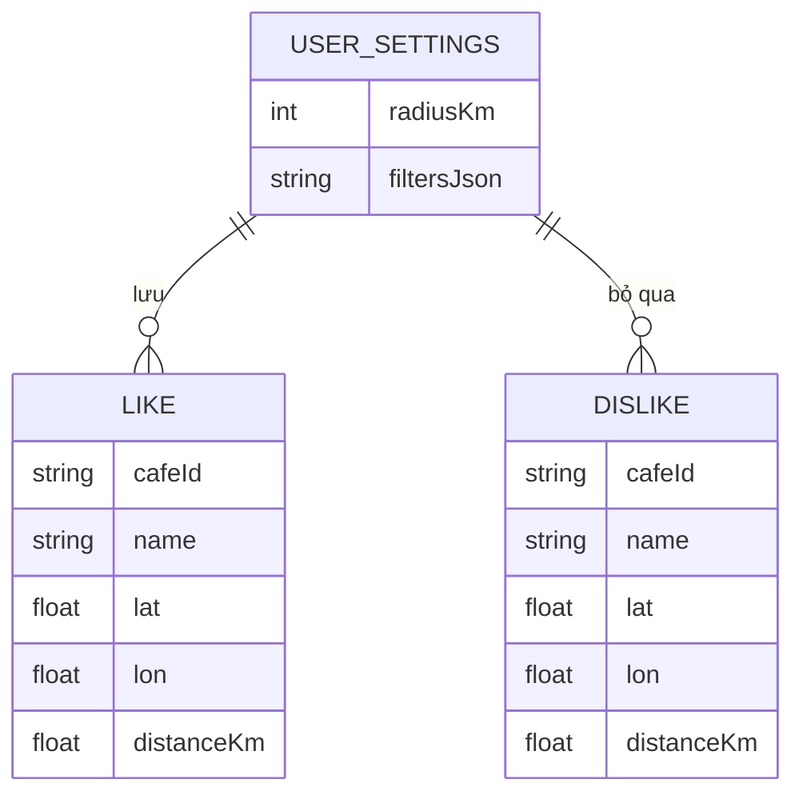

## 1. Thiết kế kiến trúc



## 2. Mô tả công nghệ
- Frontend: React@18 + TypeScript + vite
- UI: tailwindcss@3 (design tokens bằng CSS variables) + framer-motion (kéo/quẹt)
- Routing: react-router-dom
- Dữ liệu quán: gọi Overpass API theo bán kính (mặc định 5km) + fallback mock data khi không có mạng
- Lưu trạng thái: localStorage (không cần backend)

## 3. Định nghĩa route
| Route | Mục đích |
|------|----------|
| / | Điều hướng nhanh (tự chuyển /discover hoặc /settings nếu chưa có quyền) |
| /discover | Màn hình quẹt quán (chính) |
| /likes | Danh sách quán đã thích |
| /settings | Thiết lập, quyền vị trí, bán kính & bộ lọc |

## 4. Định nghĩa API (frontend-only)

### 4.1 Kiểu dữ liệu TypeScript
```ts
export type GeoPoint = {
  lat: number
  lon: number
}

export type Cafe = {
  id: string
  name: string
  location: GeoPoint
  address?: string
  distanceKm: number
  tags?: string[]
  source: "overpass" | "mock"
}

export type UserSettings = {
  radiusKm: 1 | 2 | 3 | 4 | 5
  filters: {
    openNow?: boolean
    wifi?: boolean
  }
}
```

### 4.2 Service functions
```ts
export async function getCurrentPosition(): Promise<GeoPoint>

export async function fetchCafesNear(
  center: GeoPoint,
  radiusKm: number
): Promise<Cafe[]>
```

### 4.3 Overpass request strategy
- Query theo amenity=cafe quanh (lat, lon) trong radiusKm.
- Chuẩn hóa kết quả: name (fallback “Cafe không tên”), tọa độ, suy ra distanceKm bằng Haversine.
- Bảo vệ UI: giới hạn số lượng (ví dụ 50 kết quả), sort theo gần nhất, loại trùng theo (name + tọa độ gần nhau).

## 5. Lưu trữ & đồng bộ trạng thái
- localStorage keys:
  - cafeswipe.settings
  - cafeswipe.likes
  - cafeswipe.dislikes
- Quy tắc:
  - Khi người dùng quẹt, ghi ngay để tránh mất dữ liệu khi reload.
  - Không lưu chính xác quá chi tiết khi hiển thị (UI), nhưng vẫn giữ đủ để tính khoảng cách.

## 6. Mô hình dữ liệu (không có DB)


