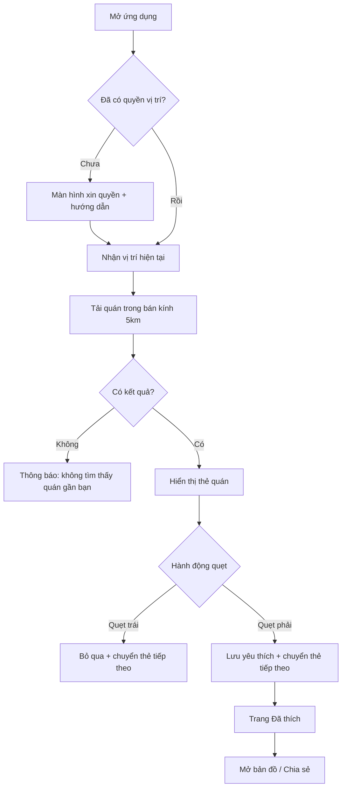

## 1. Tổng quan sản phẩm
CafeSwipe là ứng dụng kiểu “quẹt” giống Tinder để tìm quán cà phê gần vị trí hiện tại trong bán kính 5km. Người dùng quẹt phải để lưu/quán yêu thích và quẹt trái để bỏ qua, giao diện thân thiện với tông vàng ấm.
- Mục tiêu: giúp người dùng quyết định nhanh “đi quán nào” dựa trên khoảng cách, ảnh/điểm nhấn và tiện ích.
- Giá trị: trải nghiệm chọn quán nhanh, vui, trực quan; có danh sách quán đã thích để xem lại và mở bản đồ.

## 2. Tính năng cốt lõi

### 2.1 Vai trò người dùng
| Vai trò | Cách sử dụng | Quyền chính |
|--------|--------------|------------|
| Người dùng | Không cần đăng ký | Cấp quyền vị trí, xem/quẹt quán, lưu yêu thích, xem lại danh sách |

### 2.2 Mô-đun tính năng
1. **Khám phá (Swipe)**: thẻ quán theo khoảng cách 0–5km, quẹt trái/phải, “Super Like” (tùy chọn), hoàn tác 1 bước (tùy chọn).
2. **Đã thích**: danh sách quán đã quẹt phải, tìm nhanh trong danh sách, mở bản đồ chỉ đường, chia sẻ link tọa độ.
3. **Thiết lập & Quyền**: cấp quyền vị trí, chọn bán kính (mặc định 5km, chỉ cho phép 1–5km), bộ lọc cơ bản (đang mở cửa nếu có dữ liệu, có Wi‑Fi nếu có dữ liệu), reset lịch sử quẹt.

### 2.3 Chi tiết trang
| Tên trang | Mô-đun | Mô tả tính năng |
|----------|--------|------------------|
| Khám phá | Thẻ quán | Thẻ lớn, ảnh/placeholder đẹp, tên quán, khoảng cách, tag nhanh (ví dụ: “yên tĩnh”, “có ổ cắm”) nếu có dữ liệu |
| Khám phá | Điều khiển quẹt | Quẹt bằng kéo thả; nút Trái/Phải cho chuột; phản hồi rung/âm thanh (tùy chọn) |
| Khám phá | Trạng thái tải | Skeleton khi đang tải; thông báo thân thiện khi không có kết quả trong 5km |
| Đã thích | Danh sách | Card nhỏ gọn, sắp theo gần nhất hoặc mới thích; tìm theo tên |
| Đã thích | Hành động | “Mở bản đồ”, “Chia sẻ”, “Bỏ thích” |
| Thiết lập | Quyền vị trí | Hướng dẫn bật quyền; hiển thị tọa độ hiện tại (ẩn bớt độ chính xác khi hiển thị) |
| Thiết lập | Bán kính & bộ lọc | Slider 1–5km; toggle bộ lọc; lưu tự động |
| Thiết lập | Quản lý dữ liệu | Xóa lịch sử quẹt và yêu thích; xuất/nhập (tùy chọn) |

## 3. Quy trình cốt lõi
Người dùng mở ứng dụng → cấp quyền vị trí → ứng dụng tải danh sách quán trong bán kính 5km → người dùng quẹt trái/phải từng quán → quán đã thích lưu vào danh sách → người dùng có thể mở bản đồ để đi đến quán.

## 4. Thiết kế giao diện
### 4.1 Phong cách thiết kế
- Tông màu: vàng ấm chủ đạo (nền/nhấn), đi cùng nâu cà phê và xanh mint làm điểm nhấn tương phản nhẹ.
- Cảm giác: thân thiện, “ngon mắt” như thẻ menu tiệm cà phê; bo tròn lớn; đổ bóng mềm.
- Button: dạng pill, nổi nhẹ (soft shadow), hiệu ứng nhấn “nảy” tinh tế.
- Font: tiêu đề dùng kiểu serif vui mắt (ví dụ: Fraunces), nội dung dùng font Việt dễ đọc (ví dụ: Be Vietnam Pro).
- Bố cục: desktop-first với “khung điện thoại” trung tâm để giữ trải nghiệm kiểu swipe; vẫn responsive tốt trên mobile.
- Icon: nét tròn, tối giản; ưu tiên icon hình tim/ly cà phê/định vị.

### 4.2 Tổng quan thiết kế theo trang
| Tên trang | Mô-đun | UI Elements |
|----------|--------|------------|
| Khám phá | Thẻ quán | Card lớn, ảnh chiếm diện tích chính, gradient vàng nhẹ, badge khoảng cách, tag dạng pill, hiệu ứng “tilt” khi kéo |
| Khám phá | Điều khiển | Nút tròn (trái/phải) với icon lớn, hover glow vàng, trạng thái disabled khi đang tải |
| Đã thích | Danh sách | Card nhỏ, ảnh mini, tên + khoảng cách, CTA “Mở bản đồ”, sắp xếp |
| Thiết lập | Form | Slider, toggle, nút reset màu nâu, khối hướng dẫn quyền vị trí dạng note |

### 4.3 Responsive
- Desktop-first: khung nội dung tối đa ~420–480px như một thiết bị, đặt giữa màn hình, nền có texture/gradient nhẹ.
- Mobile: full width, thao tác chạm tối ưu; vùng kéo swipe lớn; nút đủ kích thước.
